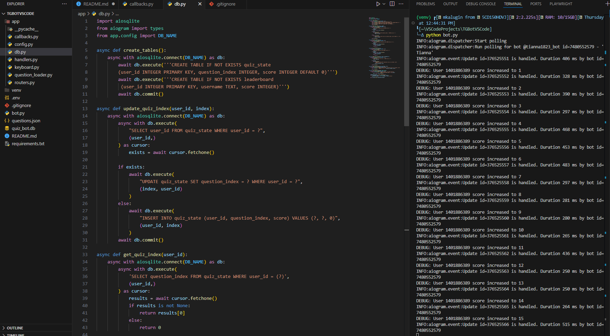
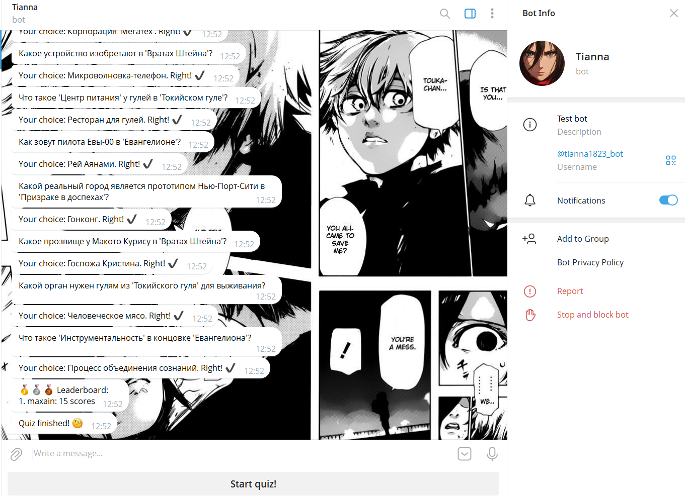

# Quiz Telegram bot

## Description
This is bot that was made in educative purposes. Represent simple quiz telegram bot with 15 questions and 4 options for every question.

## Address :
```text
t.me/tianna1823_bot
```

## Commands

### Activate venv :
```bash
  python -m venv venv
  .\venv\Scripts\activate
```

### Install deps:
```bash
  pip install -r requirements.txt
```

### Run program:

```bash
  python bot.py
```

### Example:




### Task:

1) Split the program code into several files in accordance with the logic of the code
2) Expand the functionality of the bot: add new questions and answer options. Increase the number of questions to 10. Move the questions and answers to a separate file.
3) Display the user's answers in the chat (remove the buttons when answering, and add the text)
4) Add the functionality of saving the result of passing the quiz and displaying player statistics (save the last result).

## Author - Maxim Kalugin