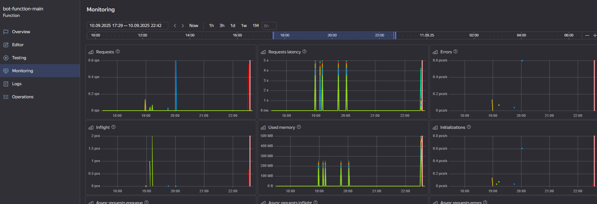
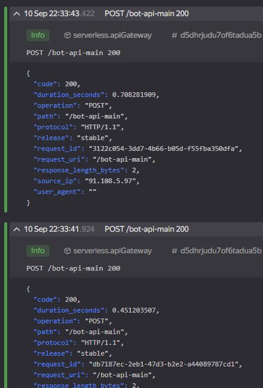

# Quiz Telegram bot

## Description
This is bot that was made in educative purposes. Represent simple quiz telegram bot with 15 questions and 4 options for every question. App was deployed on Yandex Cloud.

## Address :
```text
t.me/tianna1823_bot
```

Important :
Need set webhook between Telegram events and Gateway

Example :
```text
https://api.telegram.org/bot7480552579:AAFye5QI7DJBdW8rH9ZjM3_tuOoRs2SYdRk/setWebhook?url=https://d5dhrjudu7of6tadua5b.lievo6ut.apigw.yandexcloud.net/bot-api-main
```

### Example:





## Author - Maxim Kalugin